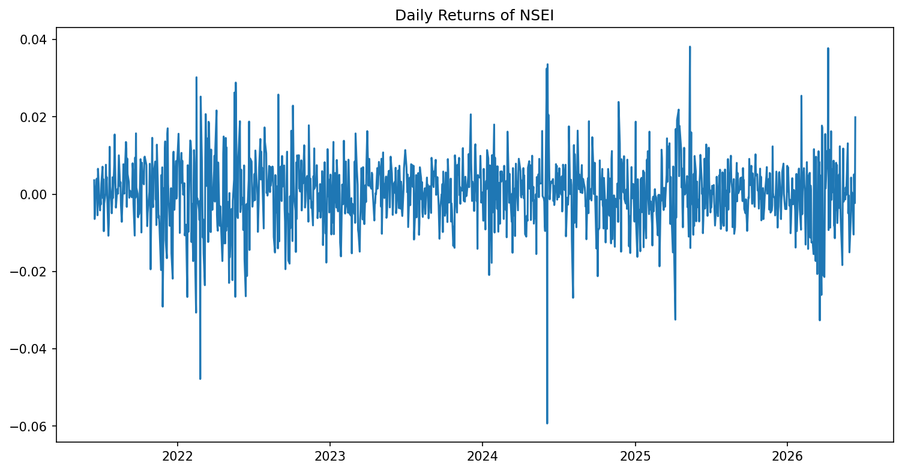

# Agentic Quant Research Assistant

An autonomous AI agent that conducts quantitative research on financial markets. Given any research question, the agent fetches real market data, runs statistical tests, executes backtests, generates visualizations, and produces a structured research report — all without human intervention.

Built with LangGraph, Groq LLM (Llama 3.3 70B), and live market data via yfinance.

---

## Demo

**Question:** "Does momentum effect exist in Nifty 50?"

**Agent autonomously:**
1. Fetches 5-year Nifty 50 OHLCV data
2. Runs momentum statistical tests (autocorrelation, t-test)
3. Searches ArXiv for relevant research papers
4. Implements and backtests a momentum strategy vs buy-and-hold
5. Generates equity curve visualization
6. Produces a structured research report

**Key findings:**
| Metric | Buy & Hold | Momentum Strategy |
|--------|-----------|-------------------|
| Annualized Return | 9.15% | 4.66% |
| Sharpe Ratio | 0.6639 | 0.3574 |
| Outperforms | — | False |

Return Autocorrelation: -0.0172 (suggests mean reversion, not momentum)



---

## Architecture

```
main.py
  │
  └── LangGraph Graph
        │
        ├── planner_node      → generates research plan from question
        │
        ├── groq_node         → LLM decides next tool to call
        │
        ├── tool_node         → executes the tool, returns result
        │   ├── fetch_data        (yfinance OHLCV data)
        │   ├── compute_stats     (autocorrelation, t-test, Shapiro-Wilk)
        │   ├── search_arxiv      (relevant research papers)
        │   └── run_code          (sandboxed Python execution)
        │
        └── report_node       → writes structured markdown report
```

**Agent loop:**

```
START → planner → agent → tool → agent → tool → ... → finish → report → END
```

The agent runs a ReAct-style loop: it receives tool results and decides what to do next until it has enough information to conclude.

---

## Project Structure

```
Agentic-Quant-Research-Assistent/
├── src/
│   ├── tools/
│   │   ├── fetch_data.py       # yfinance OHLCV fetcher
│   │   ├── run_code.py         # sandboxed Python executor
│   │   ├── search_arxiv.py     # ArXiv paper search
│   │   └── compute_stats.py    # statistical hypothesis tests
│   ├── nodes/
│   │   ├── planner.py          # research plan generator
│   │   ├── groq_node.py        # LLM reasoning node
│   │   ├── tool_node.py        # tool execution dispatcher
│   │   └── report_node.py      # report writer
│   ├── graph.py                # LangGraph graph definition
│   └── state.py                # agent state schema
├── outputs/                    # generated reports and plots
├── main.py                     # entry point
├── requirements.txt
└── .env                        # API keys (not committed)
```

---

## Quickstart

**1. Clone the repo**
```bash
git clone https://github.com/mitesh1007/Agentic-Quant-Research-Assistent.git
cd Agentic-Quant-Research-Assistent
```

**2. Create virtual environment**
```bash
python -m venv venv
source venv/bin/activate        # Mac/Linux
venv\Scripts\activate           # Windows
```

**3. Install dependencies**
```bash
pip install -r requirements.txt
```

**4. Set up API key**

Create a `.env` file in the root:
```
GROQ_API_KEY=your_groq_api_key_here
```

Get a free Groq API key at [console.groq.com](https://console.groq.com)

**5. Run the agent**
```bash
# Default question
python main.py

# Custom research question
python main.py "Is Nifty 50 returns normally distributed?"
python main.py "Does mean reversion exist in Apple stock?"
python main.py "Does momentum effect exist in S&P 500?"
```

---

## Example Research Questions

| Question | Ticker Used | Key Tool |
|----------|------------|----------|
| Does momentum effect exist in Nifty 50? | ^NSEI | compute_stats + backtest |
| Is Nifty 50 returns normally distributed? | ^NSEI | Shapiro-Wilk test |
| Does mean reversion exist in Apple stock? | AAPL | autocorrelation analysis |
| Does momentum effect exist in S&P 500? | ^GSPC | momentum backtest |

---

## Tools

| Tool | Description |
|------|-------------|
| `fetch_data` | Downloads OHLCV data via yfinance, computes return statistics |
| `compute_stats` | Runs autocorrelation, t-test, Sharpe, Shapiro-Wilk based on hypothesis |
| `search_arxiv` | Finds top-3 relevant research papers from ArXiv |
| `run_code` | Executes sandboxed Python — agent writes its own analysis code |

---

## Tech Stack

| Component | Technology |
|-----------|-----------|
| Agent Framework | LangGraph 1.2.5 |
| LLM | Groq — Llama 3.3 70B Versatile |
| Market Data | yfinance 1.3.0 |
| Statistical Tests | scipy, numpy |
| Visualizations | matplotlib |
| Paper Search | arxiv 4.0.0 |

---

## Key Design Decisions

**Why LangGraph over raw loops?**
LangGraph provides explicit state management and conditional routing between nodes. The graph structure makes the agent's decision flow transparent and debuggable — critical for research applications.

**Why sandboxed code execution?**
The `run_code` tool writes code to a temp file and executes it in a subprocess with a 60-second timeout. This isolates execution from the main process and prevents runaway loops.

**Why Groq?**
Free tier with fast inference. Llama 3.3 70B is strong enough for structured JSON tool-calling and quantitative reasoning.

---

## Output

Each run generates two files in `outputs/`:
- `report_TIMESTAMP.md` — structured research report with methodology, results, and conclusion
- `plot_TIMESTAMP.png` — equity curve and rolling return visualization
